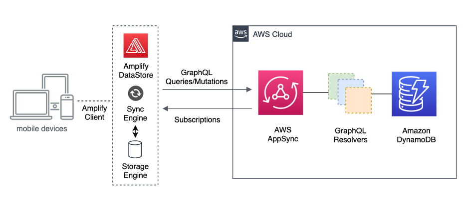

<!-- [![LinkedIn][linkedin-shield]][https://www.linkedin.com/in/viral-sangani/]
 -->

<!-- PROJECT LOGO -->

<br /><p align="center"><a href="https://github.com/GeekyAnts/flutter_amplify_datastore_demo"></a><h1 align="center">Whatsapp Clone using Amplify DataStore in Flutter</h1></p>

## About The Project



### Built With

- [Flutter](https://flutter.dev/)
- [AWS Amplify DataStore](https://docs.amplify.aws/lib/datastore/getting-started/q/platform/flutter)

<!-- GETTING STARTED -->

## Getting Started

To get a local copy up and running follow these simple steps.

### Prerequisites

- You should have Flutter installed in your system.
- AWS account is required to provision all the resources.
- AWS Amplify CLI should be installed and configured with AWS Account.

### Installation

1. Clone the repo

   ```sh
   git clone https://github.com/GeekyAnts/flutter_amplify_datastore_demo
   ```

2. Install NPM packages

   ```sh
   flutter pub get
   ```

3. Run Amplify init to initialize Amplify project and app api to provision resource

   ```sh
   amplify init
   amplify add api
   amplify add auth
   // Choose email and password authentication.
   ```

4. Replace graphql schema in `amplify/backend/api/FlutterAmplifyApi/schema.graphql` file with below content.

   ```graphql
   type ChatRoom
     @model
     @auth(rules: [{ allow: public }])
     @key(name: "byUser", fields: ["userID"]) {
     id: ID!
     otherUserId: String
     otherUserName: String
     userID: ID
     chatId: String
     untitledfield: String
   }

   type ChatData @model @auth(rules: [{ allow: public }]) {
     id: ID!
     message: String
     createdAt: AWSDateTime
     chatRoomId: String
     senderId: String
   }

   type User @model @auth(rules: [{ allow: public }]) {
     id: ID!
     username: String!
     email: String
     bio: String
     profileImage: String
     isVerified: Boolean
     createdAt: AWSDateTime
     chats: AWSJSON
     ChatRooms: [ChatRoom] @connection(keyName: "byUser", fields: ["id"])
   }
   ```

<!-- CONTRIBUTING -->

## Contributing

Contributions are what make the open source community such an amazing place to be learn, inspire, and create. Any contributions you make are **greatly appreciated**.

1. Fork the Project
2. Create your Feature Branch (`git checkout -b feature/flutter_amplify_datastore_demo`)
3. Commit your Changes (`git commit -m 'Add some flutter_amplify_datastore_demo'`)
4. Push to the Branch (`git push origin feature/flutter_amplify_datastore_demo`)
5. Open a Pull Request
